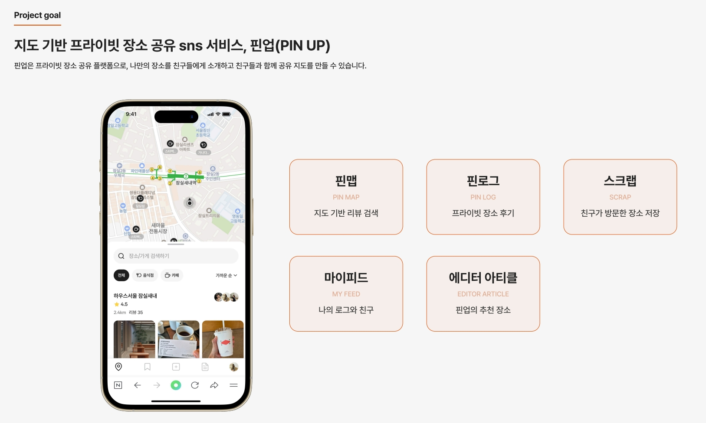
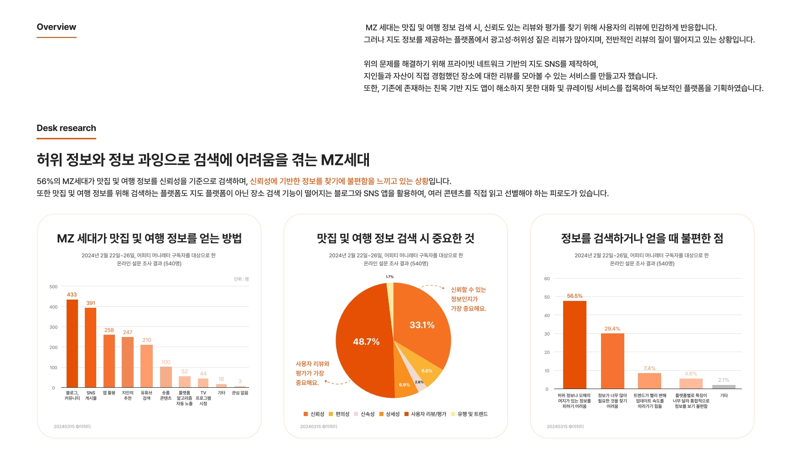
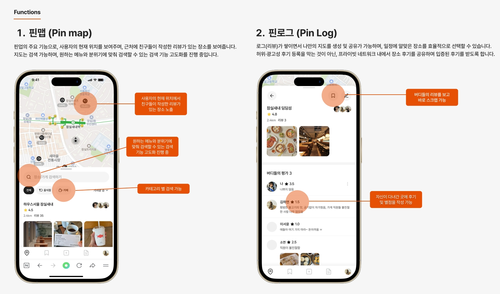
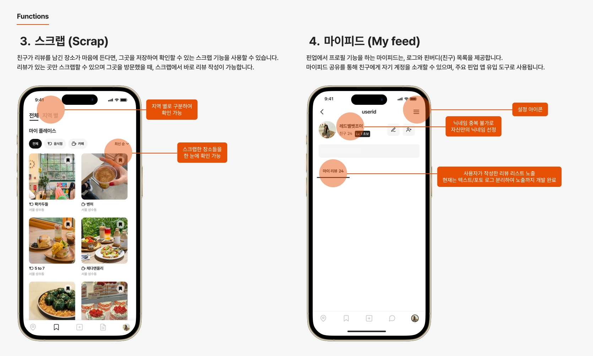
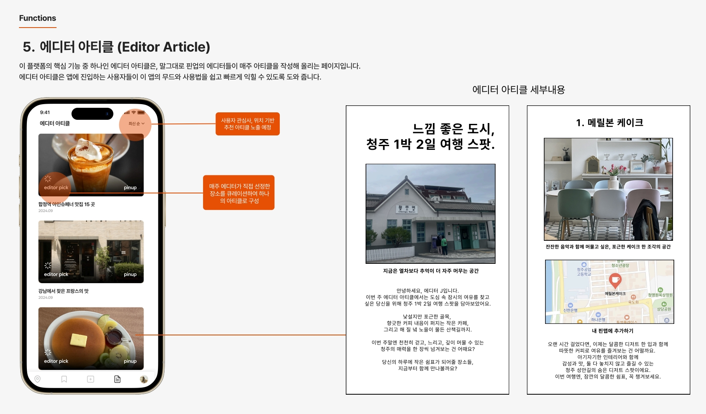
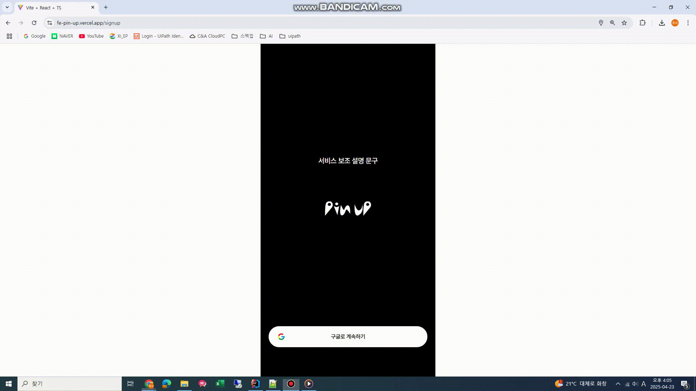
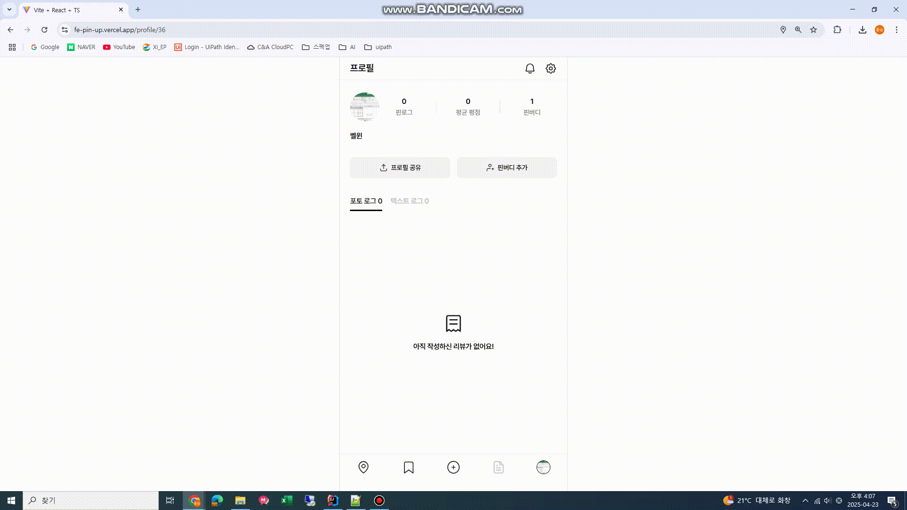
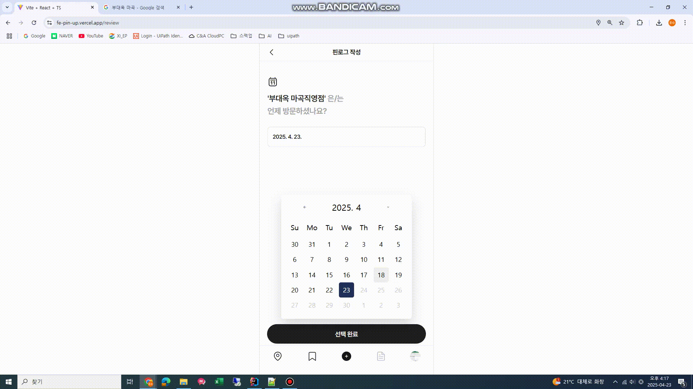
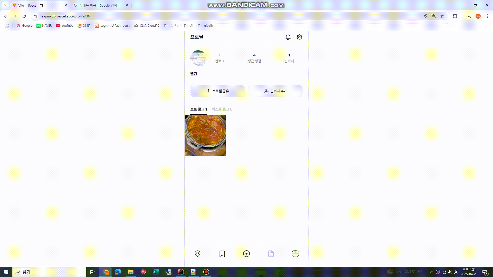
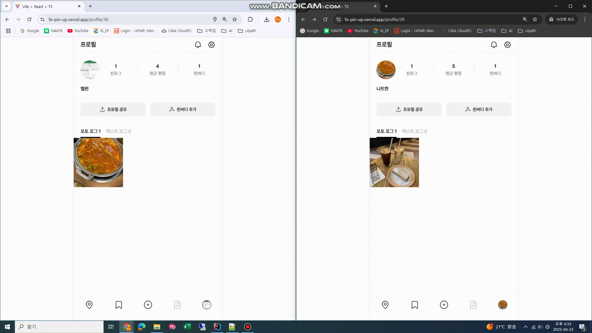

# PIN UP - BACKEND

## 0. 목차
1. [**서비스 소개**](#1)
2. [**주요 기능**](#2)
3. [**기술 스택**](#3)
4. [**ER Diagram**](#4)
5. [**시스템 아키텍처**](#5)
6. [**기능 시연**](#6)

 

## ✨ 1. 서비스 소개

### 📌 핀업(PIN UP)

### 🚀 개요

 

## ⚒️ 2. 주요 기능

 

## 📚 3. 기술 스택

| Category   | TechStack                                      |
|------------|------------------------------------------------|
| Framework  | Java, SpringBoot                               |
| DB & ORM   | MariaDB, Redis, JPA, QueryDSL                  |
| API Docs   | Swagger                                        |
| Infra      | Docker, GitHub Actions, AWS                    |
| ETC        | Kakao Map Web API                              |

 

## 🏢 4. ER Diagram

 

## 🏛️ 5. 시스템 아키텍처

 

## 📷 6. 기능 시연

### 1. 간편 회원가입 (구글 로그인)

### 2. 핀로그 등록
#### 2-1. 핀로그 작성할 장소 검색 (카카오맵 API 사용)

#### 2-2. 핀로그 작성

### 3. 핀목록 조회
* 지도에서 본인과 핀버디의 핀을 조회할 수 있습니다.
  - 핀버디가 아닌 유저의 핀은 조회되지 않습니다.
* 카테고리 필터링과 정렬 조건에 따라 핀을 조회할 수 있습니다.

### 4. 핀버디 추가
* 닉네임으로 핀버디를 검색할 수 있습니다.
* 핀버디 신청/수락/거절 기능이 제공됩니다.

 
