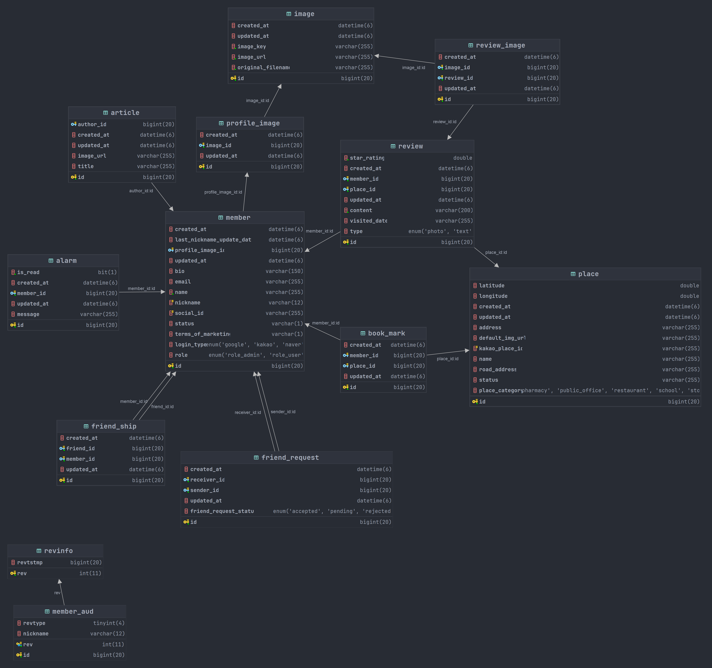

# 📌 핀업(PIN UP) - BACKEND

# 🔗 목차
1. [**서비스 소개**](#1)
2. [**주요 기능**](#2)
3. [**기술 스택**](#3)
4. [**기술적 도전**](#4)
5. [**API 명세서**](#5)
6. [**ER Diagram**](#6)
7. [**시스템 아키텍처**](#7)
8. [**기능 시연**](#8)

 

## ✨ 1. 서비스 소개
> **핀업**은 지도 기반 **프라이빗 장소 공유 플랫폼**으로, 나만의 장소를 친구들에게 소개하고 친구들과 함께 **공유 지도**를 만들 수 있습니다.

### 🎯 문제 정의
MZ 세대는 맛집 및 여행 정보 검색 시, 신뢰도 있는 리뷰와 평가를 찾기 위해 사용자의 리뷰에 민감하게 반응합니다.
 
그러나 지도 정보를 제공하는 플랫폼에서 **광고성·허위성 짙은 리뷰**가 많아지며, 전반적인 리뷰의 질이 떨어지고 있는 상황입니다.

### 🛠️ 해결 방안: 프라이빗 네트워크 기반 지도 SNS의 도입
위의 문제를 해결하기 위해 **프라이빗 네트워크 기반의 지도 SNS**를 제작하여,
 
지인들과 자신이 직접 경험했던 장소에 대한 리뷰를 모아볼 수 있는 서비스를 만들고자 했습니다.
> 비상업적 장소(러닝 코스, 산책길, 풍경 좋은 자리 등)도 공유 가능

 

## ⚒️ 2. 주요 기능

 

## 📚 3. 기술 스택

| Category   | TechStack                                      |
|------------|------------------------------------------------|
| Language & Framework  | Java, Spring Boot                   |
| DB & ORM   | MariaDB, Redis, JPA, QueryDSL                  |
| API Docs   | Swagger                                        |
| Infra      | Docker, GitHub Actions, AWS                    |
| ETC        | Kakao Map Web API                              |

 

## 🚀 4. 기술적 도전
- **지도 API 연동 및 장소 등록 프로세스 설계/구현**
  - 문제인식:
    - 수백만 건의 장소 데이터를 자체 DB에 구축할 경우, **초기 데이터 구축 비용이 높음**
    - 지속적인 데이터 업데이트 관리가 복잡해지는 문제점 파악
  - 해결방안:
    - **카카오맵 API**와 연동하여 필요 시점에 장소 데이터(상호명, 위경도 좌표, 고유ID)를 **선별적으로 DB에 저장**하는 시스템 구현
    - 유저의 첫 리뷰가 등록되는 시점에 해당 장소 데이터만 DB에 삽입하는 방식으로 **데이터 관리 비용 절감**
- **사용자 맞춤형 지도 서비스 개발**
  - **QueryDsl**을 활용한 동적 쿼리 구현으로 **친구의 리뷰 데이터만 지도에 표시**하는 기능 개발
  - 지도 줌 레벨에 따른 **인접한 장소 클러스터링 알고리즘** 구현으로 사용자 경험 향상
  - 지도 영역(북동/남서 위/경도 범위) 기반 페이지네이션 적용으로 조회 성능 80% 개선 (939ms -> 131ms)
  - 검색어, 카테고리(음식점, 카페), 정렬 조건(거리순, 평점순) 기반 필터링 기능 개발
  - 하버사인 공식을 적용한 **현재 위치 기준 장소까지의 거리** 계산 알고리즘 구현
  - Key-Value 형태의 자료구조를 활용한 장소의 친구 리뷰 평점 통계 그래프 구현
- **편리성과 보안을 고려한 사용자 인증 시스템 구축**
  - **OAuth 2.0** 기반 소셜 로그인(구글, 카카오, 네이버) 구현으로 가입 절차 간소화
  - Access Token과 Refresh Token을 활용한 기존 설계된 인증 시스템 보안 강화 및 사용자 경험 향상 (빈번한 재로그인 방지)
  - Refresh Token 활용하여 새로운 토큰쌍을 재발급하는 방식으로 토큰 탈취 위험 최소화
  - Redis를 활용한 Refresh Token 관리로 처리 속도 향상 및 토큰 TTL 설정으로 만료 시 자동 삭제
- **CI/CD 파이프라인 구축 및 인프라 관리**
  - Github Actions, Docker Registry, Docker-Compose를 활용한 **빌드 및 배포 자동화** 구현
  - 개발/운영 환경 분리 및 Github Secret을 활용한 설정 정보 보안 관리로 안정적인 배포 프로세스 확립
  - AWS 기반 서비스 인프라 구축 및 관리

 

## 📑 5. API 명세서

 

## 🏢 6. ER Diagram

 

## 🏗️ 7. 시스템 아키텍처
- 도식 중

 

## 📷 8. 기능 시연

### 1. 간편 회원가입 (구글 로그인)

### 2. 핀로그 등록
#### 2-1. 핀로그 작성할 장소 검색 (카카오맵 API 사용)

#### 2-2. 핀로그 작성

### 3. 핀목록 조회
* 지도에서 본인과 핀버디의 핀을 조회할 수 있습니다.
  - 핀버디가 아닌 유저의 핀은 조회되지 않습니다.
* 카테고리 필터링과 정렬 조건에 따라 핀을 조회할 수 있습니다.

### 4. 핀버디 추가
* 닉네임으로 핀버디를 검색할 수 있습니다.
* 핀버디 신청/수락/거절 기능이 제공됩니다.

 
